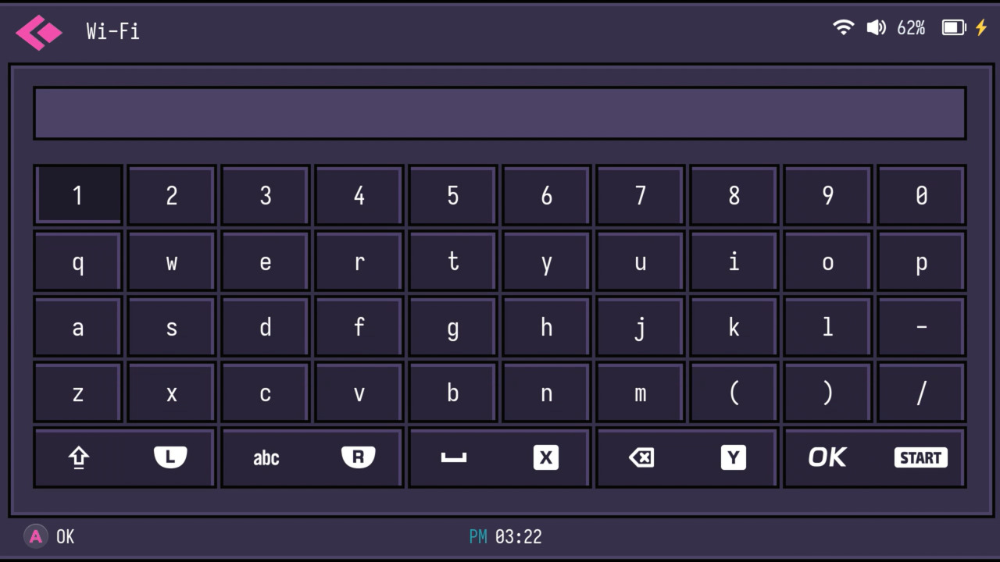

# Retrowave
Port of my [Retrowave](https://github.com/godlyranchdressing/retrowave-theme) theme for the TrimUI Smart Pro. To install, just rename the "theme" folder to "Retrowave" and copy that to the "Theme" folder on your device.

I pulled some assets from the TrimUI Retro theme (icons). Also includes an SVG asset set to use as a base for other TrimUI themes.

